<script type="module">
    Array.from(document.getElementsByClassName("language-mermaid")).forEach(element => {
      element.classList.add("mermaid");
    });
    import mermaid from 'https://cdn.jsdelivr.net/npm/mermaid@11/dist/mermaid.esm.min.mjs';
    mermaid.initialize({ startOnLoad: true });
</script>

# Table of Contents

- [Reference values](#reference-values)
  - [`T` <-> `&T` with `Deref<Target = T>`](#t-t-with-dereftarget-t)
    - [Heap -> Referenced objects](#heap-referenced-objects)
    - [Smart pointers](#smart-pointers)
  - [Remember this!](#remember-this)
    - [Parameters](#parameters)
    - [Return values](#return-values)
- [Impl/Generic parameters](#implgeneric-parameters)
  - [Remember this!](#remember-this)
- [Unconstrained generics](#unconstrained-generics)
  - [Inherent Identity](#inherent-identity)
  - [Four-sided Circles](#four-sided-circles)
  - [Inedible Food](#inedible-food)
  - [Rainbow Cat](#rainbow-cat)
  - [Remember this!](#remember-this)
- [Ownership](#ownership)
  - [When can I return owned values?](#when-can-i-return-owned-values)
    - [`Copy`able values](#copyable-values)
    - [Owned values created in the function](#owned-values-created-in-the-function)
    - [Owned values transferring ownership](#owned-values-transferring-ownership)
  - [`PhantomData<T>`](#phantomdatat)
    - [Identifying Generics](#identifying-generics)
      - [Remember this!](#remember-this)
    - [Covariancy](#covariancy)

I've been programming in Rust for a while, and I have helped a lot of people learn it as well, but most novices fall into the same couple traps. These usually come from a superficial level of the trait system, the borrow checker, etc. I hope to explain the *how* behind these concepts and patterns that are so deeply integrated into every piece of Rust code you'll ever see.

## Reference values

As a general rule, values that are going to be owned should be passed by value, and references should be accepted as parameters[^1] and returned.

Instead of:

```rs
struct Message {
    msg: String, // Good
    data: Vec<u8>, // Good
}

impl Message {
    fn msg(&self) -> String /* Bad! */ {
        self.msg.clone() // Now you have to clone...
    }

    fn data(&self) -> Vec<u8> {
        self.data.clone() // Same thing.
    }

    fn msg_eq(&self, rhs: String /* Bad! */) -> bool {
        self.msg == rhs
    }
}
```

Do this instead:

```rs
struct Message {
    msg: String, // Good
    data: Vec<u8>, // Good
}

impl Message {
    fn msg(&self) -> &str {
        &self.msg // Good, `String` derefs to `&str`.
    }

    fn data(&self) -> &[u8] {
        &self.data // `Vec<T>` derefs to `&[T]`.
    }

    fn msg_eq(&self, rhs: &str) -> bool {
        // `&str` is not an owned type, so the caller does not necessarily have to construct
        // an owned value (`String`).
        self.msg == rhs
    }
}
```

### `T` <-> `&T` with `Deref<Target = T>`

`Deref` is a special trait that has some sweeping implications on the type system. The trait signature is as follows:

```rust
pub trait Deref {
    type Target: ?Sized;

    // Required method
    fn deref(&self) -> &Self::Target;
}
```

And it's pretty simple: it takes `&self` and returns `&Target`, where `Target` doesn't have to be `Sized` (so reference types without the reference) but what really does this mean and how is it used?

There are two instances where `Deref` is used:

1. Heap -> Referenced objects.
2. Smart pointers.

#### Heap -> Referenced objects

Some heap-allocated types have a referenced (stack) variant, such as:

* `String` -> `&str`
* `PathBuf` -> `&Path`
* `Vec<T>` -> `&[T]`

In mathematical terms, we could represent it as $$O \sqsubseteq R$$ where `O` is the owned variant of the `R`eference, meaning that any `O` can be used in contexts where `R` is expected.

In programming terms, this usually is implemented by having the underlying type in an owned type, such as:

```rust
struct MyGeneric<T> {
    it: T,
}
```

Then we could implement `Deref`:

```rust
impl<T> Deref for MyGeneric<T> {
    type Target = T;

    fn deref(&self) -> &Self::Target {
        &self.it
    }
}
```

Signifying that `MyGeneric<T>` can be used in all cases where `T` is.

This is how `String` -> `&str` works, sort of, because you see, there's a little more to it. The page on [type coercions](https://doc.rust-lang.org/reference/type-coercions.html#r-coerce.types.deref) specify that trivial conversions can be done when:

Given a `&T`, where `T` implements `Deref<Target = U>`, it can trivially convert to `&U`, which is why you can do:

```rust
fn foo(bar: &str) {}

let my_string = String::from("hello!");
foo(&my_string);
```

Because we pass in `&String` into a function that expects `&str`, and `String` implements [`Deref<Target = str>`](https://doc.rust-lang.org/std/string/struct.String.html#impl-Deref-for-String)!

#### Smart pointers

`todo!();`

### Remember this!

#### Parameters

The most important thing to take away from this is to ask yourself these questions:

1. Does my function *need* to take input passed by value?
2. What extra value does my function gain by taking passed by values versus a referenced value?

If your answers are "not really" and "none", you should use a reference value instead.

#### Return values

Ask yourself these questions:

1. Does the caller need the owned value and can the function even return the owned value?
2. Does it implement [`Copy`](https://doc.rust-lang.org/std/marker/trait.Copy.html)?

If your answers are "no" and "no", return a reference.

If your answers are "no" and "yes", return the value without a reference.

If your answer is "wtf do you mean 'can it even return the owned value'?", [skip here](#ownership).

## Impl/Generic parameters

This is particularly important in library code; not *as* important elsewhere, but it's good to know about. Remember that readability is the most important part of this, so consider and choose carefully when you use this, which is why this is more common in library code.

Your function should take input as generically as possible whenever you can, so ask yourself the following question: "do I need this type specifically or am I using it because it implements the feature I actually want?"

For example, the following code wants a parameter that will be looped over. In the first example, the parameter expects a *slice* of `T` which will be iterated over.

```rust
fn iter_and_print<T>(iter: &[T])
where
    T: Display,
{
    for elem in iter {
        println!("{}", elem);
    }
}
```

While accepting a slice is a very common and *perfectly valid* way of doing this, you really wanted something that can be looped over, so you might find it better to accept an [`IntoIterator`](https://doc.rust-lang.org/std/iter/trait.IntoIterator.html). This may be better in many cases:

```rust
fn iter_and_print<T>(iter: impl IntoIterator<Item = T>)
where
    T: Display,
{
    for elem in iter {
        println!("{}", elem);
    }
}

// Or if you don't want the impl part (there are technical differences between that and the following code, but it's minimal):

fn iter_and_print<I, T>(iter: I)
where
    I: IntoIterator<Item = T>,
    T: Display,
{
    for elem in iter {
        println!("{}", elem);
    }
}
```

This is much more generic and is more clear to the caller and to you what your function expects, such as:

1. The function wants *something* that has iteration abilities.
2. The iterator wants each loop to give out a `T`.

### Remember this!

By using generics over concrete types, you are making clear your API and what features a function expects to be given while also giving the caller as much flexibility as possible.

## Unconstrained generics

Often, you might find yourself wanting to add generic bounds on the struct/enum itself. **NEVER EVER DO THIS** (*except in a couple cases that I will show below*) **!** Constraining generics onto structs/enums force you to duplicate it everywhere you use it (even when you don't need that bound (*more below*))!

Let's try to build a silly example:

```rust
// A jar that holds a prize!
struct PrizeJar<T> {
    contents: T,
}

impl<T> PrizeJar<T> {
    fn new(contents: T) -> Self {
        Self { contents }
    }
}
```

Now I really want to add a function that doubles the prize pot, so many new Rust programmers might be tempted to change the struct definition to:

```rust
use std::ops::MulAssign;

struct PrizeJar<T: MulAssign + Copy> { ... }
```

Which now spreads everywhere:

```rust
use std::ops::MulAssign;

// A jar that holds a prize!
struct PrizeJar<T: MulAssign + Copy> {
    contents: T,
}

impl<T> PrizeJar<T>
where
    T: MulAssign + Copy,
{
    fn new(contents: T) -> Self {
        Self { contents }
    }

    fn double(&mut self) {
        self.contents *= self.contents;
    }
}
```

But this has many drawbacks, such as:

1. The *where clause* (or wherever you add bounds) must now always include the bounds.
2. A method on the struct may not even need that bound to work, but it now required to support it.
3. It drastically limits what input you can take.

Instead, you should have a bare generic bound on the struct/enum, and add bounds individually to each method as is seen fit:

```rust
use std::ops::MulAssign;

// A jar that holds a prize!
struct PrizeJar<T> {
    contents: T,
}

impl<T> PrizeJar<T> {
    fn new(contents: T) -> Self {
        Self { contents }
    }
}

// Only works when the prize can be doubled (and copied).
// It would make no sense that a one-of-a-kind crown can
// be doubled, but cash sure does make sense.
impl<T> PrizeJar<T>
where
    T: MulAssign + Copy,
{
    fn double(&mut self) {
        self.contents *= self.contents;
    }
}
```

Now for those very few cases where it is better to have the bounds on the item itself:

### Inherent Identity

I coined this term to mean structs/enums that have bounds on them intentionally and thoughtfully. Whenever you see something like `Object<T: Trait>`, don't think of it like, "all `Object`s must constrain `T` to implement `Trait`", instead, it means, "`Object` is illogical without `T` having `Trait`". Because of this, the verbosity tradeoff of having a trait bound on every `impl` and method is okay, because every method in the object must assume those properties, for instance, think about the following English examples, then I will map that to Rust code:

1. A four-sided circle.
2. Inedible food.
3. A rainbow cat.

Only one of these examples has an some identity not inherent to itself, that being the rainbow cat.

### Four-sided Circles

A circle is defined as a shape where all points are the same distance from a given point, the center. Thus, it is illogical that a circle can have a property where it has four sides because that violates its inherent identity, so we could define it in code as this:

```rust
struct Point {
    x: f64,
    y: f64,
}

trait CircleShape {
    fn center(&self) -> Point;
    fn radius(&self) -> f64;
}

trait RectangleShape {
    fn points(&self) -> [Point; 4];
}

// Circle shape must always be a circle, anything else violates its inherent identity!
struct Circle<T: CircleShape> {
    shape: T,
}
```

### Inedible Food

By the definition of food, it must be edible (fit for human consumption), so we could model it this way:

```rust
// Can a human digest it?
trait Edible {}

// Is it palatable?
trait Eatable: Edible {}

// All food must be at least edible, even if you don't like it ;)
trait Food: Edible {}

trait Person {
    fn name(&self) -> &str;
    fn likes<T: Food + Eatable>(&self, _food: &T) -> bool;
}

struct Snack<T: Food> {
    snack: T,
}

impl<T: Food> Snack<T> {
    fn new(snack: T) -> Self {
        Self { snack }
    }
}

impl<T: Food + Eatable> Snack<T> {
    fn liked_by<P: Person>(&self, who: &P) -> bool {
        who.likes(&self.snack)
    }
}
```

By doing this, we have encoded the inherent property into `Snack` that food by definition cannot be inedible; it's always edible, unless you eat bricks, and that in order for someone to like it, it must be eatable for them.

### Rainbow Cat

Cats do not strictly have a set color as part of their identity: they can be beige, black, spotted, even hairless! And even so, many methods don't require the property about it's color, so we could model it like this:

```rust
#[derive(Copy, Clone)]
struct Rgb {
    r: u8,
    g: u8,
    b: u8,
}

struct NoColor;

trait Color {
    fn what_color(&self) -> Option<Rgb>;
}

impl Color for Rgb {
    fn what_color(&self) -> Option<Rgb> {
        Some(self)
    }
}

impl Color for NoColor {
    fn what_color(&self) -> Option<Rgb> {
        None
    }
}

struct Cat<C> {
    name: String,
    color: C,
}

impl<C> Cat<C> {
    fn new<S>(name: S, color: C) -> Self
    where
        S: Into<String>,
        C: Color,
    {
        Self { name: name.into(), color }
    }
}
```

There is no inherent identity of hair (or lack thereof) on a cat; it's simply a feature of them, but it's not *strictly* core to its identity.

### Remember this!

Your struct/enum, whenever it takes methods that are bounded, should only assume those features on a method call, *not* on the entire object. This makes a couple things clear and simple:

1. The burden of satisfying the given trait bounds falls upon the caller, not you.
2. You only get what you pay for: if you specify some methods that only work when certain bounds are satisfied and the caller does not provide those but tries to use the method, the compiler will tell them that.
2. A method only has the capabilities that the bounds on it describe (compartmentalization).

Furthermore, you do not have to be strict about inherent identity and bounding traits on the struct/enum. Inherent identity as far as the caller is concerned lies only in how they can construct that object, meaning that the following two appear and function the same to the caller:

```rust
struct InherentIdentity<T: SomeTrait> {
    item: T,
}

impl<T: SomeTrait> InherentIdentity<T> {
    fn new(item: T) -> Self {
        Self { item }
    }
}
```

```rust
struct NoInherentIdentity<T> {
    item: T,
}

impl<T> InherentIdentity<T> {
    fn new(item: T) -> Self
    where
        T: SomeTrait,
    {
        Self { item }
    }
}
```

And in fact, many Rust programmers write inherent identity the second way, because it's less verbose, but you just have to be super careful with how your object can be constructed, because if you somehow forget to bound a method that generates you a `Circle`, you could end up with a metaphysically impossible rectangular circle, thus probably breaking the internal assumptions of the methods of `Circle`. If that worries you, you can always bound an entire `impl` block and do all your assumptions in there.

## Ownership

There's a lot to cover here, so for the most part, I will give super high level overviews and maybe an example or two.

### When can I return owned values?

Owned values can only be returned in three instances:

1. They are `Copy`able.
2. The owned value is created inside the function.
3. When they are transferring ownership.

#### `Copy`able values

`Copy` is a trait that instructs the compiler that a value is trivially copyable (values can be bitwise copied). Any type that contains some form of reference cannot implement `Copy`, because a bitwise copy on that value would copy the reference, not the value underneath the reference. The copied reference means that there would be two pointers to the inner value, so when the first value you copied goes out of scope, it will deallocate that memory, leaving you with two problems:

1. Your underlying data is now missing in your second value.
2. Assuming you don't try to interact with that missing data (unlikely), once the second value goes out of scope, it will try to free empty memory (double free!).

Here's a diagram that goes through the steps of a theoretical `Copy`able pointer, where we did something like:

```rust
let my_obj = obj::new();
let my_obj2 = my_obj; // Copied here.
```



```mermaid
flowchart LR
    A["my_obj (ptr → Heap)"]
    H["Heap Data"]
    B["my_obj2 (ptr → Heap)"]

    A -. copied .-> B
    A -->|"*ptr (0x7fff6850ccdc)"| H
    B -->|"*ptr (0x7ffd3ae29cbc)"| H

    linkStyle default stroke: white
```

Notice how both have access to the same underlying data at the same time. This is actually allowed in Rust, but only when the values are not owned values in an enum/struct and are in the same lifetime, so this is perfectly valid:

```rust
let my_num = 5;
let my_ref = &my_num;

let my_ptr = *my_ref;
let my_second_ptr = *my_ref;
```

But this is not:

```rust
let my_string = String::from("hello"); // Good
let my_stref = &my_string; // Good

let my_strointer = *my_stref; // Nope, not allowed.
let my_second_strointer = *my_stref; // Ditto.
```

<!-- I could totally do a "whoops I just dropped my object for my magnum rust code" -->

But back to our copyable pointer object. Now we have successfully copied the pointer and the object, so let's throw a wrench in this: I just [dropped](https://doc.rust-lang.org/std/ops/trait.Drop.html#tymethod.drop) `my_obj` out of scope, it no longer exists:

```mermaid
flowchart LR
    A["my_obj (ptr ↛ Heap)"]
    H["Heap Data"]
    B["my_obj2 (ptr → Heap)"]

    A -->|"*ptr (0x7fff6850ccdc)"| H
    B -->|"*ptr (0x7ffd3ae29cbc)"| H

    style A fill:#FF0000,color:#000000,stroke:#444
    style H fill:#FF0000,color:#000000,stroke:#444

    linkStyle default stroke: white
```



Well shit. You can see the problem right? There's a pointer to a place that doesn't exist anymore. If you even use/look at/interact with that pointer, your program will explode. This is exactly why Rust follows RAII and strictly prevents multiple ownership.


Oh and even if you manage to never use that pointer the rest of the time it's in scope, you still have to deal with the deconstructor, which will try to free that memory under the pointer, and just like in C, when you double free, you explode and Dennis Ritchie comes and chides you for your failures.

If you understood none of that, don't worry, it's mostly technical. In practice, `Copy` is usually on values that don't store data on the heap (because data on the heap must be accessed via pointers), and you can check the [implementors](https://doc.rust-lang.org/std/marker/trait.Copy.html#implementors) list for a list of all the standard library objects that are copyable.

#### Owned values created in the function

Any owned value created in a function can be returned. You've seen this a lot more than you think, it's *extraordinarily* common:

```rust
struct CoolString {
    val: String,
}

impl CoolString {
    fn new<S: Into<String>>(val: S) -> Self /* And here's where it's returned */ {
        Self { val: val.into() } // <-- Here's the owned value that was created in the function.
    }
}
```

#### Owned values transferring ownership

This one is pretty simple. In Rust, the RAII principle is followed, meaning three things: a value can only have one owner, a value can have many references to it, and when a value's lifetime is no longer in the scope's lifetime that it was created in, it will be freed. This is why you can't return owned values when you have `&self`:

```rust
struct Foo(String);

impl Foo {
    fn val(&self) -> String {
        self.0 // Nope, won't work
    }
}
```

Because `&self` is a reference to the current object (the owner), you cannot return the owned value out, because that would mean that there are now two owners at two different scopes and/or lifetimes (and either way, you don't actually have access to the underlying value, just a reference to it). Instead, you must return a reference (like you've seen before), or transfer ownership out of the owner:

```rust
struct Foo(String);

impl Foo {
    fn val(self) -> String {
        self.0 // Works now!
    }
}
```

Because `self` is now saying "gimme ownership of this object", you have full ownership of its values, meaning two things:

1. The object at the end of the method will drop out of scope because it's not being returned.
2. Because of this, you can return out its members, because the Rust compiler is smart enough to know that the object won't exist by the end of the function, so it permits this.

This is how builder patterns in Rust work, because you chain methods that take `self` and return new values from them:

```rust
struct Foo {
    bar: String,
    baz: u64,
    bing: Vec<char>,
}

struct FooBuilder {
    bar: String,
    baz: u64,
    bing: Vec<char>,
}

impl FooBuilder {
    fn new() -> Self {
        Self {
            bar: String::new(),
            baz: u64::MIN,
            bing: vec![],
        }
    }

    fn bar<S: Into<String>>(mut self, bar: S) -> Self {
        self.bar = bar.into();
        self
    }

    fn baz(mut self, baz: u64) -> Self {
        self.baz = baz;
        self
    }

    fn bing<I>(mut self, bing: I) -> Self
    where
        I: IntoIterator<Item = char>,
    {
        self.bing = bing.into_iter().collect();
        self
    }

    fn build(self) -> Foo {
        Foo {
            bar: self.bar,
            baz: self.baz,
            bing: self.bing,
        }
    }
}

fn main() {
    let foo = FooBuilder::new()
        .bar("here's bar!")
        .baz(17)
        .bing(['w', 'o', 'a', 'h'])
        .build();
}
```

### `PhantomData<T>`

#### Identifying Generics

`PhantomData<T>` is a special struct in Rust, because it contains a generic but never instantiates it.

Now in Rust (except for this case), any struct/enum with a generic must be instantiated with that value somewhere in it:

```rust
enum Option<T> {
    Some(T),
    None,
}
```

It makes no sense to the compiler to have something like:

```rust
struct CollegePerson<T> {
    name: String,
    id: u16,
}
```

But I really just want to add some generic that can be used as an identifier and do some custom logic depending on it. In comes `PhantomData<T>`: It's a generic marker holder that takes up no space in the struct and is simply a hint to the compiler that you want to operate on a generic just based on the properties of `T`, not on the properties of the value of `T`.

A couple weeks ago, I saw this [video by Tsoding](https://youtu.be/xNX9H_ZkfNE) where he wrote a graphics library for the [PPM image format](https://en.wikipedia.org/wiki/Netpbm), so I decided to make my own in Rust, and it was going along great! I implemented both the ASCII and binary formats, and had a `Display` impl on it so that I could write it out to the console, but then I realized, "wait, that only works for ASCII, it makes no sense for binary formats". So I sketched out something that looked roughly like:

```rust
use std::fmt::Display;

trait PpmFormat {}

trait PpmAscii: PpmFormat {}
trait PpmBinary: PpmFormat {}

struct Ascii;
struct Binary;

impl PpmAscii for Ascii {}
impl PpmFormat for Ascii {}

impl PpmBinary for Binary {}
impl PpmFormat for Binary {}

struct Ppm<T: PpmFormat> { ... }

impl<T: PpmFormat> Ppm<T>
where
    T: PpmBinary,
{
    fn as_bytes(&self) -> Vec<u8> { ... }
}

impl<T: PpmFormat> Display for Ppm<T>
where
    T: PpmAscii,
{
    fn fmt(&self, f: &mut fmt::Formatter<'_>) -> fmt::Result { ... }
}
```

This is how I forced a compile-time enforcement for different PPM formats; I think it's a lot better than matching on some enum for the format, because now, a `Ppm<PpmBinary>` cannot just display itself, because it's raw bytes, it makes no sense.

But wait, there's a big problem: I just need the identity of `T`, I don't actually need the `T` itself. This is where I add `PhantomData<T>`:

```rust
use std::marker::PhantomData;

struct Ppm<T: PpmFormat> {
    _marker: PhantomData<T>,
    ...
}

impl<T: PpmFormat> Ppm<T> {
    fn new(...) -> Self {
        Self {
            _marker: PhantomData,
            ...
        }
    }
}
```

If I had to come up with a more self-evident name for this use case, I would've chosen `GenericMarker<T>`.

##### Remember this!

Use `PhantomData<T>` when you want a generic marker to do custom compile-time logic in your object without actually owning a value of `T`.

#### Covariancy

The other use case for `PhantomData<T>` is to denote covariancy, which is a concept where $$\prime A \sqsubseteq \prime B$$, meaning that if `'a` lives at least as long as `'b`, `'a` may be used anywhere that `'b` is. Let's start with a simple example:

```rust
// Both `x` and `y` must last at least the same lifetime.
fn longest<'t>(x: &'t str, y: &'t str) -> &'t str {
    if x.len() > y.len() { x } else { y }
}

fn main() {
    // '1
    let outer = String::from("hello");
    // '1
    let chosen;
    { // '2
        // '2
        let inner = String::from("hi");
        chosen = longest(outer.as_str(), /* Uh oh! -> */ inner.as_str());
    }
    // '1
    println!("{}", chosen);
}
```

`longest` expects `outer` and `chosen` to have at least the same lifetime. I'll give you a minute to spot exactly what line causes the problem.

Ready? There's actually two places that cause a problem, so I will go over the simpler one first.

If you remove the `println!`, the program will compile because we don't actually ever end up using `chosen`, and the compiler is smart enough to know that since you didn't use it, it won't complain even though the lifetimes are indeed messed up, but that's not really useful for us, because we want to actually use the value.

The real place that causes the problem is assigning `chosen`. Because its lifetime is `'2`, it exists for less than `'1`, which breaks our `longest` contract which states that they must be at least the same.

Now if you've been a careful reader, you'll notice I've not said "the same lifetime", instead, "at least the same lifetime". That's because there is a special lifetime called `'static`, which states that the reference will live *until* the end of the lifetime of the running program. Many novices misunderstand `'static` to mean "lives the entire program" but that is only one way you can use it:

```rust
static NUM: usize = 67; // Lives the entire program

fn main() {
    let my_str = "hello!"; // Lives in memory the rest of the program
                           // but will go out of scope just like all
                           // other variables.
}
```

Now when I say "at least the same lifetime", that is because `'static` can be temporarily downgraded to the lifetime of the other value:

```rust
static NUM: usize = 67;

fn downgrade<'a>(a: &'a usize) { ... }

fn main() {
    let my_str = "hello!";
    {
        _ = downgrade(&NUM);
    }
}
```

Even though `downgrade` does not specify a `'static` lifetime, `NUM` will downgrade into `'a`.

Now wayyyy back to `PhantomData<T>`. It supports an optional lifetime, so you could have `PhantomData<&'a T>`. Because Rust only allows lifetimes on references, there's a problem that becomes especially apparent when using *pointers* in FFI:

```rust
struct Range<T> {
    lower: *const T,
    upper: *const T,
}
```

Because pointers have no lifetimes (you can't do `*'a const T`), we can't assure the compiler that `lower` and `upper` will even live for at least the lifetime of `Range`! Now we can use `PhantomData<&'a T>`:

```rust
struct Range<'a, T: 'a> {
    lower: *const T,
    upper: *const T,
    _lifetime: PhantomData<&'a T>,
}
```

Two things you should notice:

1. We added a lifetime `'a` and made `T: 'a`, telling the compiler that `T` must live at least as long as `'a`. This is our contract.
2. We added `PhantomData<&'a T>`, which tells the compiler, "yes, `T` will live at least as long as `'a`". This is our "implementation".

This is mainly used in FFI when the code you are wrapping has the same contract of lifetimes but cannot be automatically detected by the Rust compiler.

---

[^1]: When they are not being stored.
