# Table of Contents

* auto-gen TOC:
{:toc}

I *really* like Millard Fillmore, and I think it's a shame that people have to go to bespoke websites to find anything written by him, so I want to make this as a document containing *anything* I can get my hands on about him!

Please don't cite this page yourself, I will provide citations at the bottom for you go get this information for yourselves.

I will at some points add my own annotations linking to other websites that may explain what he was talking about. I will also put stars on items that I believe are important to know.

# Timeline

```mermaid
timeline
    title Chronology of Millard Fillmore
    section Early Life
        1800 : Born at Locke, now Summerhill, Cayuga county, New York.
        1815 : At work wool-carding and cloth-dressing.
        1818 : Taught school at Scott, New York.
             : Began reading law with Judge Wood at Montville, Cayuga county.
    section Lawyer Era
        1819 : Continued reading law at Montville.
        1821 : Moved to Aurora (now East Aurora, Erie county), New York.
        1822 : Read law in Buffalo, but lived in Aurora till spring, 1830.
        1823 : Practiced law in Aurora.
        1826 : Feb. 5. Married Abigail, daughter of the Rev. Lemuel Powers.
        1827 : Admitted to the bar, as attorney of the Supreme Court.
        1828 : April 25 - Millard Powers Fillmore born.
             : May 22. Delegate to the Erie county convention of the National Republicans; member of the county committee from Aurora; endorsed John Quincy Adams.
             : Nov. Elected to the New York Assembly, as candidate of the Anti-Masonic party.
        1829 : Admitted as counsellor, New York Supreme Court.
             : Reelected to New York Assembly.
        1830 : Formed law partnership with Joseph Clary.
             : Reelected to New York Assembly.
        1831 : Jan. 4. Took seat for third time in New York Assembly. Distinguished himself by drafting and advocating act to abolish imprisonment for debt; bill passed April 26, 1831.
        1832 : March 27 - Mary Abigail Fillmore born.
    section Congressional Era
        1832 : Elected Representative in Twenty-third Congress.
        1833 : Dec. 2. First took seat in House of Representatives.
        1834 : Law firm of Fillmore & Hall formed.
        1836 : Jan. 10. Law firm of Fillmore, Hall & Haven formed.
             : Oct. 4. Renominated for Representative in Twenty-fifth Congress; later elected.
        1838 : Reelected Representative in Twenty-sixth Congress.
        1840 : Reelected Representative in Twenty-seventh Congress; chairman of Ways and Means committee; "leader of the House."
        1842 : March 3 - Obtains appropriation for Morse's magnetic telegraph.
             : June 9. Made his famous tariff speech in the House.
             : Declined renomination to Congress.
        1844 : May. Candidate for Vice-President in the Whig National convention at Baltimore.
             : Sept. 11. Nominated for Governor of New York; defeated by Silas Wright.
    section University of Buffalo
        1847 : Oct. 6. Nominated for Comptroller, New York State, in the Whig State convention at Syracuse.
             : Nov. 2. Elected Comptroller, New York State.
        1848 : Jan. 1. Assumed office as Comptroller.
    section As Vice President
        1848 : June 9. Nominated for Vice-President by the Whig National convention.
             : Nov. Elected Vice-President.
        1849 : Feb. 20. Resigned as New York Comptroller.
             : March 4. Inaugurated Vice-President.
        1850 : April 3 - Address on RUles of Order in the Senate.
    section As President
        1850 : July 10. Took oath of office as President of the United States.
             : Sept. 18. Approved Fugitive Slave Act.
        1851 : July 4. Laid the corner-stone of the Capitol extension.
        1852 : June 16-21. Unsuccessful Whig candidate for Presidential nomination in the Whig National convention at Baltimore.
             : Nov. 13. Dispatch of Commodore Matthew Calbaith Perry to Japan.
        1853 : March 4. Retired from Presidency.
    section Post-Presidency
        1853 : March 30. Mrs. Fillmore died at Washington.
        1854 : Tour of southern and western States.
             : July 26 - Death of Mary Abigail Fillmore at East Aurora, New York.
        1855 : May 17. Sailed for Liverpool.
             : Declines D.C.L degree from Oxford University.
        1856 : Feb. 22. Nominated for President by the American party at Philadelphia.
             : May 21. Wrote his letter of acceptance at Paris.
             : June 22. Arrived in New York.
             : Nov. Overwhelmingly defeated in the election, receiving only the eight electoral votes of Maryland.
        1858 : Feb. 10. Married Mrs. Caroline C. McIntosh.
    section During the Civil War
        1862 : Chairman, Buffalo Committee of Public Defense.
             : One of the incorporators, Buffalo Fine Arts Academy.
             : May 20. Chosen president, Buffalo Historical Society, which he helped to found; reelected yearly, 1862-1867.
    section Post Civil War
        1865 : Dec. 8. Executed his last will and testament. Codicils dated September 19, 1868, and April 28, 1873.
        1866 : Visited Europe with his second wife.
             : July 13. Arrived in Buffalo, from his second european trip.
        1867 : First president, Buffalo Club, and one of its founders.
        1870 : President, Buffalo General Hospital.
        1870 : Trustee, Grosvenor Library, Buffalo.
        1874 : March 8. Died at his home in Buffalo.
```

# Letters & Speeches

## 1850

### July

#### Department of State to Millard Fillmore concerning Death of Zachary Taylor (July 9th, 1850)



#### Reply of Mr. Fillmore (July 9th, 1850)



#### Communication to the Senate from Mr. Fillmore (July 10th, 1850)



#### Announcement to Congress (July 10th, 1850)



#### Order of the President (July 10th, 1850)



#### Instructions to Senate and House (July 10th, 1850)



#### Ratification of Treaty between United States and Peru (July 15th, 1850)



#### Report to Secretary of War (July 17th, 1850)



#### Requesting the Senate to be Furnished with Topographical Map of Gulf Coast (July 17th, 1850)



#### Requesting Knowledge about British Activities in "Tigre" (July 18th, 1850)



#### Millard requests a New Black Hat (July 18th, 1850)



#### Extradition Treaty with Mexico (July 20th, 1850)



#### Treaty concerning the Wyandott Tribe of Indians (July 23rd, 1850)



#### Requesting Knowledge concerning American Vessels stopped by Great Britain (July 30th, 1850)



### August

#### Information relating to the Removal of Fort Polk (August 2nd, 1850)



#### Compromise of Texas ⭐ (August 6th, 1850)



#### Clarifying Previous Letter (August 8th, 1850)



#### Indian Statistics (August 10th, 1850)



#### Delivering a Report concerning Brazos Santiago, Texas (August 24th, 1850)



#### Received Topographical Map of Gulf Coast (August 26th, 1850)



### September

#### Resignation of Edward C. Anderson (September 2nd, 1850)



#### Letter concerning Treaties between the U.S. and China and the Ottoman Porte (September 9th, 1850)



#### The Constitution of New Mexico (September 9th, 1850)



#### Cost of Mail Steamers now in Service (September 12th, 1850)



#### Information concerning Nomination of John Howard Payne as Consul to Tunis (September 16th, 1850)



#### Fugitive Slave Act ⭐ (September 18th, 1850)



#### Forwarding Zachary Taylors Family's Wishes to move Remains (September 23rd, 1850)



#### Secretary of State Response forwarded to Senate (September 27th, 1850)



#### Acceptance of Edward C. Anderson's Resignation (September 28th, 1850)



### November

#### Proclamation suspending Previous Act on Prussian Vessels (November 1st, 1850)



### December

#### State of the Union Address (December 2nd, 1850)



#### Requesting Translation of a Portion of the State of the Union to the Mexican Republic (December 9th, 1850)



#### Report from Secretary of State concerning Slave Trade (December 12th, 1850)



#### Texas agrees to Deal concerning Borders (December 13th, 1850)



#### Secretary of War inquiring about the Army being used to exercise Civil Functions in Emergencies (December 17th, 1850)



#### Forwarding Report concerning Hungarian Independence (December 30th, 1850)



## 1851

### January

#### Paying Outsourced Lawyer (January 3rd, 1851)



#### Secretary of Navy on Recent Act abolishing Flogging (January 10th, 1851)



#### On the Reorganization of Ranks of Army and Navy (January 14th, 1851)



### February

#### Possessory Rights of the British Hudsons Bay Company in Oregon (February 3rd, 1851)



#### On the Compensation of Freed Slaves from a Spanish Vessel (February 12th, 1851)



#### United States and Swiss Confederation General Convention (February 13th, 1851)



#### Requesting Information concerning Contract Alleged to have been made with Mexican Government (February 13th, 1851)



#### Reports from Secretary of State and Treasury concerning captured British Ship *Albion* (February 13th, 1851)



#### Additional Information concerning *Albion* (February 13th, 1851)



### May

#### Arrangements to Attend Opening of Railroad Line from the Atlantic to the Great Lakes (May 8th, 1851)



### December

#### State of the Union Address



## 1852

### April

#### Perusing "Uncle Tom's Cabin" (April 8th, 1852)



### May

#### Appointment to see Governor Gibbs (May 25th, 1852)



### June

#### Acknowledgment of the Gift of "a beautiful picture of 'Ancient Jerusalem'" (June 17th, 1852)



### July

#### "I would rather be right than be President" (July 23rd, 1852)



### December

#### State of the Union Address



## 1853

### March

#### Millard sends Thanks for a Book (March 3rd, 1853)



## 1856

### June

#### 1856 Election Campaign Speeches ⭐ (June, 1856)



### September

#### "You Can Not Reason With Fanaticism" (September 12th, 1856)



### October

#### Relief concerning the Soon End of the 1856 Election (October 29, 1856)



## 1862

### March

#### Lincoln tempts Tyranny (March 3rd, 1862)



#### Abraham Lincoln's Election caused the War (March 12th, 1862)



## 1863

### May

#### Millard asks Lincoln for a Favor (May 16th, 1863)



---

# Sources
* <https://archive.org/details/guide-to-microfilm-fillmore-papers-rotated-watermark/page/18/mode/2up>
* <https://www.gutenberg.org/cache/epub/5021/pg5021-images.html>
* <https://www.gutenberg.org/files/10951/10951-h/10951-h.htm#con3>
* <https://www.shapell.org/>
* <https://archive.org/details/wsb17f28_images/wsb17f28/mode/2up>
* <https://en.wikisource.org/wiki/United_States_Statutes_at_Large/Volume_9/31st_Congress/1st_Session/Chapter_60>
