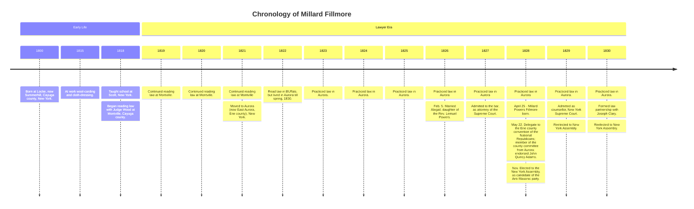

# Table of Contents

* auto-gen TOC:
{:toc}

I *really* like Millard Fillmore, and I think it's a shame that people have to go to bespoke websites to find anything written by him, so I want to make this as a document containing *anything* I can get my hands on about him!

Please don't cite this page yourself, I will provide citations at the bottom for you go get this information from yourselves.

I will at some points add my own annotations linking to other websites that may explain what he was talking about.

# Timeline

# Letters

## 1850

### December

#### State of the Union Address



## 1851

### December

#### State of the Union Address



## 1852

### December

#### State of the Union Address



## 1853

---

#### Sources
* <https://archive.org/details/guide-to-microfilm-fillmore-papers-rotated-watermark/page/18/mode/2up>
* <https://www.gutenberg.org/cache/epub/5021/pg5021-images.html>
